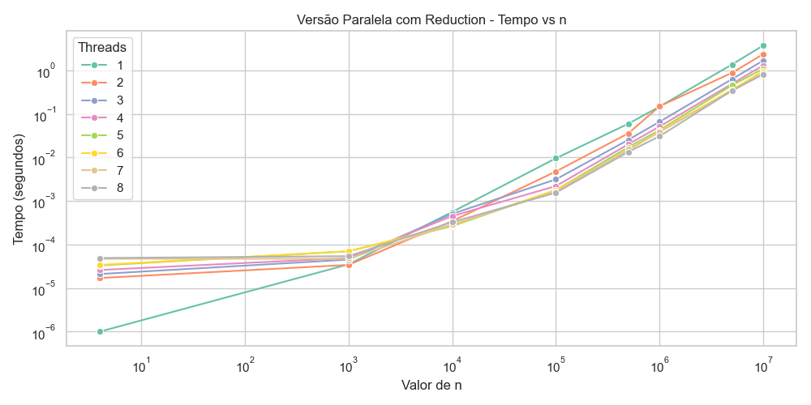
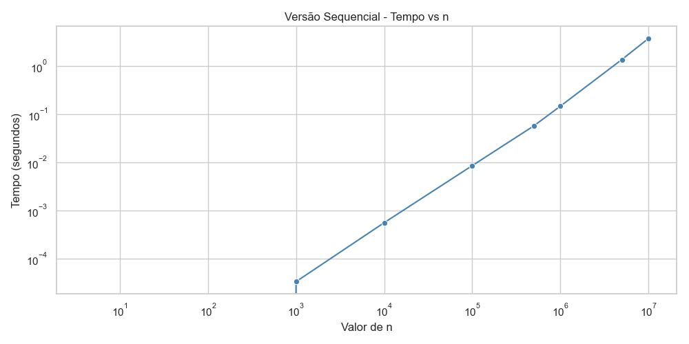
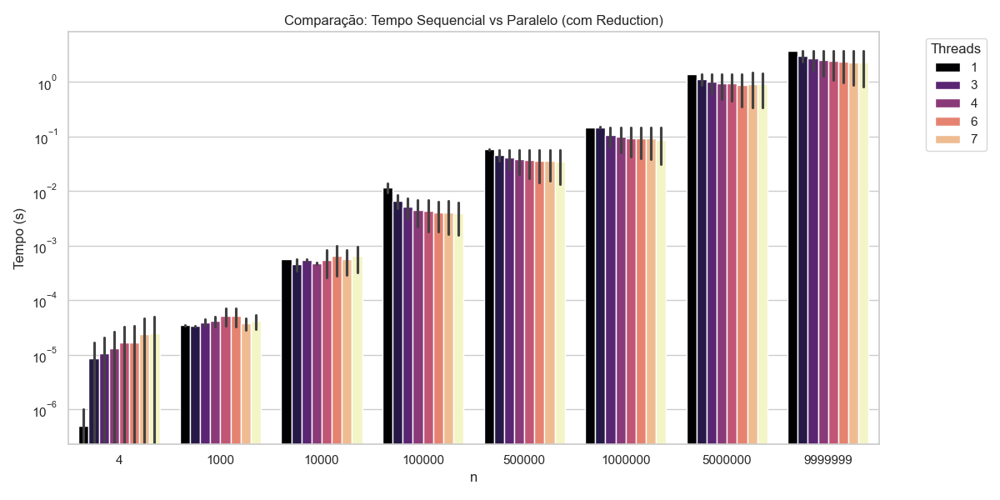

# Tarefa 5 - Comparação entre Programação Sequencial e Paralela



## 📌 Descrição

Este projeto tem como objetivo comparar o desempenho de diferentes abordagens para resolver o mesmo problema computacional: a contagem de números primos até um valor `n`. As abordagens analisadas são:

- Implementação **sequencial**
- Implementação **paralela sem tratamento de condição de corrida** (incorreta)
- Implementação **paralela com tratamento adequado via `reduction`** (correta)

A partir dessas versões, foram avaliados aspectos como tempo de execução, impacto da quantidade de threads e escalabilidade da solução.

## 📂 Estrutura do Projeto

```md
.
├── prime.c                     # Código-fonte principal com as três versões (documentado)
├── out/
│   ├── results.csv             # Arquivo com os resultados dos testes (gerado em tempo de execução)
│   ├── task-5.comparison-between-sequential-and-parallel-programming/out/grafico_paralela_reduction_threads.png
│   ├── task-5.comparison-between-sequential-and-parallel-programming/out/grafico_sequencial.png
│   ├── task-5.comparison-between-sequential-and-parallel-programming/out/grafico2_comparacao_barras.png
│   └── task-5.comparison-between-sequential-and-parallel-programming/out/grafico3_seq_vs_parallel8.png
└── README.md                   # Este arquivo
```

### Compilar

Certifique-se de ter o `gcc` com suporte a OpenMP instalado.

```bash
gcc -fopenmp prime.c -o ./out/prime.o
```

### Executar

```bash
./out/prime.o
```

O programa irá executar os testes para diferentes tamanhos de entrada (`n`) e variações no número de threads (de 1 até 8). Os resultados serão salvos no arquivo `./out/results.csv`.

### Gráficos

Os seguintes gráficos foram construídos a partir dos dados obtidos e estão disponíveis na pasta `out/`:

```bash
cd task-5.comparison-between-sequential-and-parallel-programming
source venv/bin/activate
python ./plot.py
```

1. **Versão Sequencial - Tempo vs n**  
   Evidencia o crescimento linear do tempo de execução da versão sequencial com o aumento de `n`.

2. **Versão Paralela com Reduction - Tempo vs n**  
   Mostra como a execução paralela correta se comporta em relação ao tamanho da entrada.

3. **Comparação: Tempo Sequencial vs Paralelo (com Reduction)**  
   Compara diretamente a eficiência das versões, evidenciando o ponto de virada onde a paralela supera a sequencial.

4. **Tempo de Execução: Paralelo com diferentes números de threads**  
   Permite observar o impacto do número de threads no desempenho e possíveis variações no comportamento ao longo dos testes.

