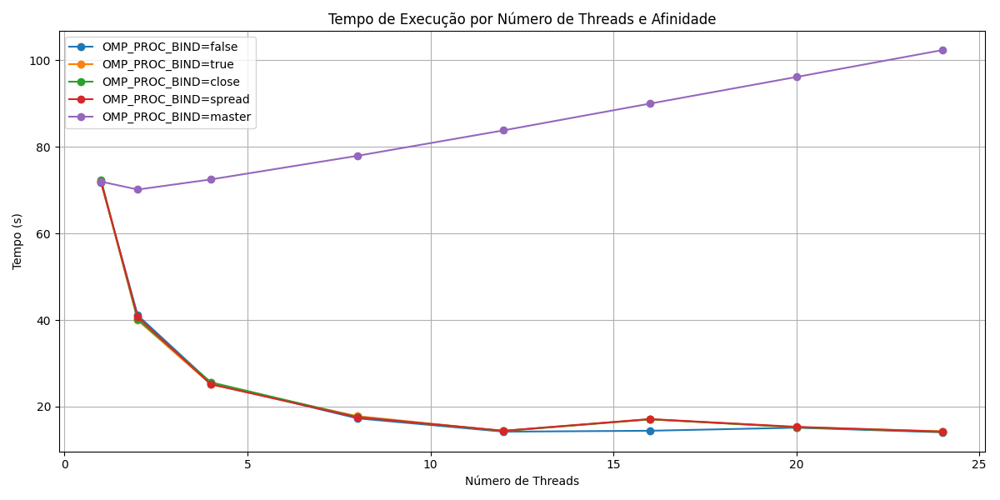
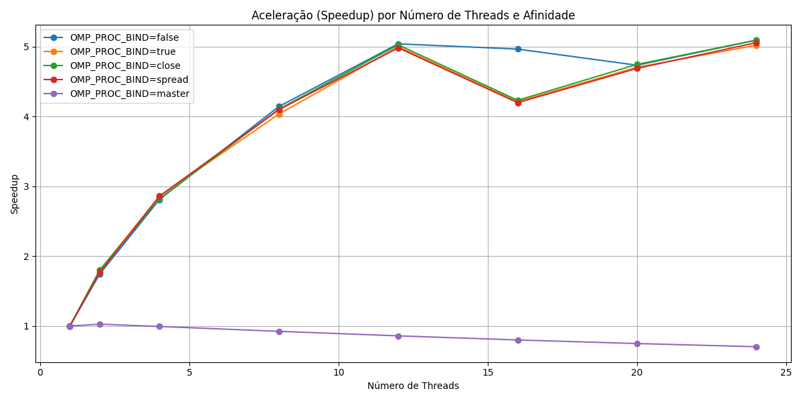
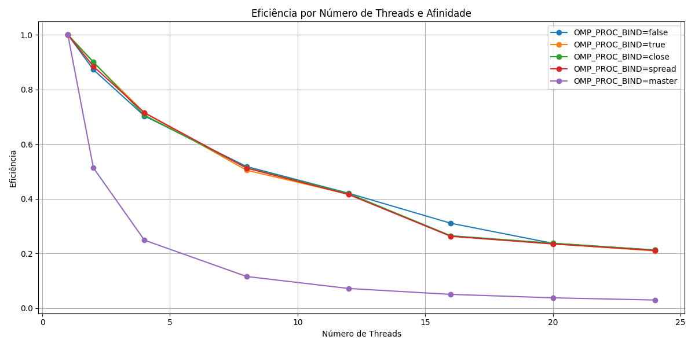

# 🌀 Análise de Escalabilidade com Afinidade de Threads em OpenMP

Este repositório contém um estudo de desempenho aplicado à simulação simplificada das equações de Navier-Stokes em 3D, com foco na avaliação da **afinidade de threads** utilizando **OpenMP** em um ambiente de computação de alto desempenho (HPC). O objetivo é compreender como diferentes configurações de `OMP_PROC_BIND` afetam a escalabilidade da aplicação.

## 📌 Objetivos

- Avaliar o impacto de diferentes políticas de afinidade de threads (`false`, `true`, `close`, `spread`, `master`) no desempenho de uma aplicação paralela.
- Medir **tempo de execução**, **aceleração (speedup)** e **eficiência** para diferentes números de threads (1 a 24).
- Gerar visualizações que auxiliem na análise dos resultados.

## 🚀 Execução

Para compilar e executar o código no ambiente SLURM:

```bash
sbatch run.sh
````

O script irá:

* Compilar o programa com `gcc -O3 -fopenmp`.
* Executar o binário para cada combinação de afinidade e número de threads.
* Salvar os tempos de execução no arquivo CSV.

## 📊 Visualização dos Resultados

O script `plot.py` gera três gráficos:

1. **Tempo de Execução** por número de threads.
2. **Aceleração (Speedup)** relativa ao tempo com 1 thread.
3. **Eficiência** da paralelização.

## 📈 Exemplos dos Gráficos

**Tempo de Execução:**



**Aceleração (Speedup):**



**Eficiência:**

