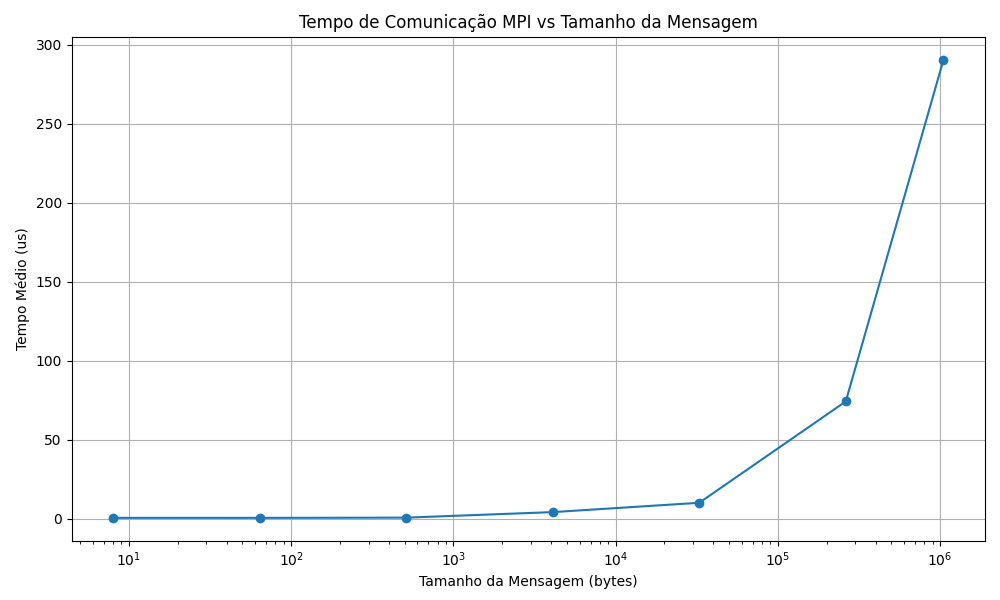

# Tarefa 14: Latência de Comunicação usando MPI

Este repositório contém a implementação e análise da Tarefa 14 da disciplina de Programação Paralela, cujo objetivo é medir a latência de comunicação entre dois processos MPI através de um experimento do tipo *ping-pong*.

## 📋 Descrição da Atividade

O programa realiza múltiplas trocas de mensagens entre dois processos (`rank 0` e `rank 1`). O processo 0 envia uma mensagem ao processo 1, que a devolve imediatamente. Esse ciclo é repetido várias vezes e o tempo médio de ida e volta da mensagem é registrado para diferentes tamanhos, desde 8 bytes até 1 MB.

## 🛠️ Tecnologias e Ferramentas

- Linguagem: C
- Biblioteca: MPI (Message Passing Interface)
- Compilador: `mpicc`
- Ambiente de execução: Cluster NPAD (UFRN)
- Análise de dados: Python com `pandas` e `matplotlib`
- Sistema de submissão: SLURM

## 📊 Exemplo de Resultado

| Tamanho da Mensagem (bytes) | Tempo Médio (µs) |
|-----------------------------|------------------|
| 8                           | 0.50             |
| 64                          | 0.49             |
| 512                         | 0.63             |
| 4.096                       | 4.13             |
| 32.768                      | 10.04            |
| 262.144                     | 74.20            |
| 1.048.576                   | 290.47           |



## 📌 Como Executar

1. Submeta o script ao SLURM:

  ```bash
  sbatch submit.sh
  # O script compila o código fonte em C com:
  mpicc -O3 -o pingpong main.c
  ```

2. Aguarde o término da execução e consulte o arquivo de saída `results-pingpong-<job_id>.out` para verificar os resultados.

## 📚 Objetivos de Aprendizado

* Compreender os conceitos de latência e largura de banda em comunicação MPI.
* Implementar e medir comunicações ponto a ponto com `MPI_Send` e `MPI_Recv`.
* Analisar experimentalmente o impacto do tamanho da mensagem no desempenho da comunicação.
* Utilizar ferramentas de HPC para experimentos controlados.