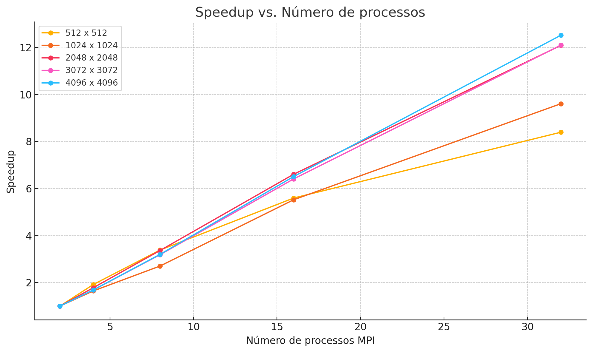
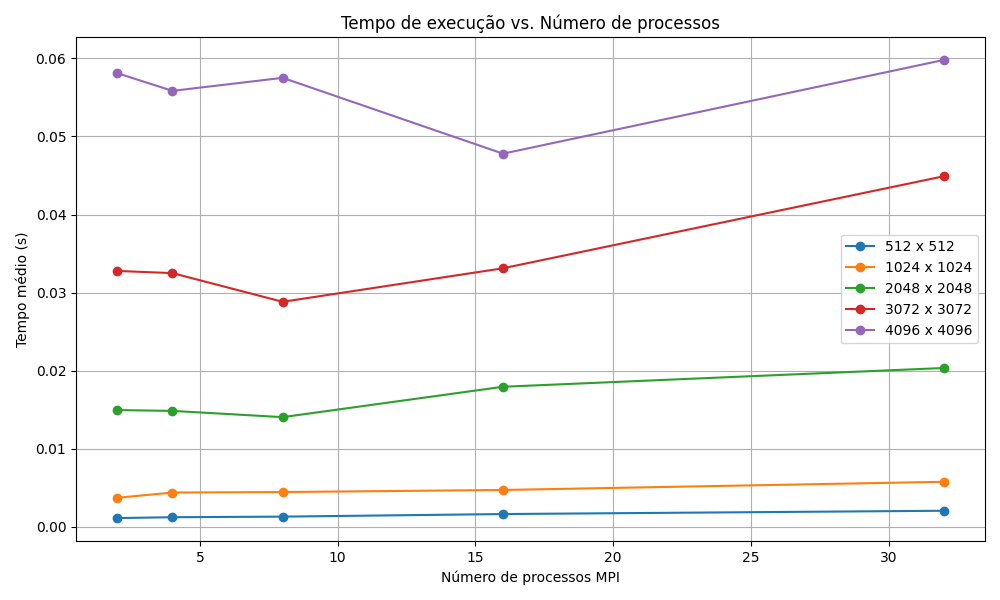
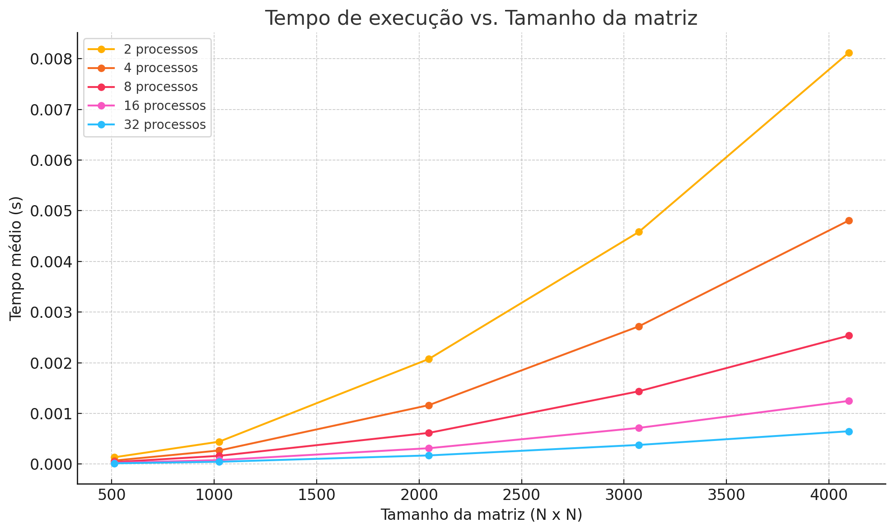

# 📘 Produto Matriz-Vetor com MPI

## 🧩 Objetivo

Este projeto implementa a multiplicação de uma matriz $A$ por um vetor $x$, resultando em $y = A \cdot x$, usando **MPI (Message Passing Interface)** para paralelizar o cálculo entre múltiplos processos.

O foco está em:

* Dividir o trabalho de forma balanceada ou desbalanceada.
* Avaliar o desempenho da aplicação com diferentes tamanhos de matriz e número de processos.
* Estudar o impacto das funções de comunicação MPI utilizadas.

## 🖥️ Estrutura do Código

### 🔨 Compilação

Use `mpicc` com otimização para compilar o código:

```bash
mpicc -o matvec main.c
```

### ▶️ Execução via SLURM

Um script `bash` (`sbatch`) automatiza os testes com múltiplos tamanhos de matriz e diferentes quantidades de processos MPI:

```bash
sbatch script_job.sh
```

## 🚀 Lógica da Paralelização

### 1. **Distribuição da matriz `A`**

* A matriz é dividida **por linhas**.
* Como `M` (número de linhas) pode **não ser divisível** por `P` (número de processos), usamos:

> ✅ `MPI_Scatterv`: permite distribuir **números variáveis de linhas** por processo, diferentemente de `MPI_Scatter`, que exige que todos recebam a mesma quantidade.

### 2. **Distribuição do vetor `x`**

> ✅ `MPI_Bcast`: é utilizado para **enviar uma cópia inteira de `x` para todos os processos**, já que todos precisam dele para computar suas respectivas linhas.

### 3. **Cálculo local em cada processo**

Cada processo calcula seu subconjunto de $y$ correspondente às suas linhas da matriz.

### 4. **Recolhimento dos resultados**

> ✅ `MPI_Gatherv`: permite coletar **quantidades variáveis** de elementos resultantes de $y$ de volta no processo root, respeitando a distribuição desigual feita inicialmente.

## 📈 Gráficos e Análise de Resultados

### Arquivos de saída utilizados para os gráficos:

### 1. **Speedup vs. Número de Processos**



* Para **matrizes pequenas**, o speedup **decresce** com mais processos → a **sobreposição de comunicação** e o **overhead de paralelização** superam o ganho.
* Para **matrizes grandes**, há ganho real até certo ponto, mas o speedup eventualmente **satura ou diminui**.

### 2. **Tempo de Execução vs. Número de Processos**



* **Melhor desempenho** em 2, 4 ou 8 processos, dependendo do tamanho da matriz.
* Para **32 processos**, o tempo tende a crescer, indicando que o custo da comunicação supera o benefício da divisão de trabalho.

### 3. **Tempo de Execução vs. Tamanho da Matriz**



* O tempo cresce **linearmente com o número de elementos**.
* Porém, **a escalabilidade depende do número de processos** — para tamanhos muito grandes, 32 processos ajudam; para tamanhos pequenos, atrapalham.

## 📌 Por que usar `MPI_Scatterv` e `MPI_Gatherv`?

| Função         | Quando usar                                   | Usada no código? |
| -------------- | --------------------------------------------- | ---------------- |
| `MPI_Scatter`  | Quando todos recebem igual                    | ❌                |
| `MPI_Scatterv` | Quando cada processo recebe partes diferentes | ✅                |
| `MPI_Gather`   | Quando todos enviam quantidades iguais        | ❌                |
| `MPI_Gatherv`  | Quando cada processo envia partes diferentes  | ✅                |
| `MPI_Bcast`    | Para enviar o mesmo dado a todos              | ✅                |