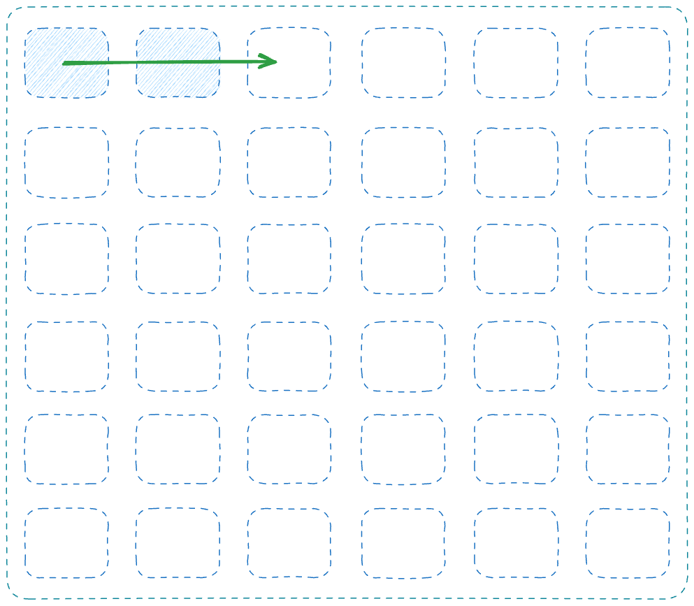
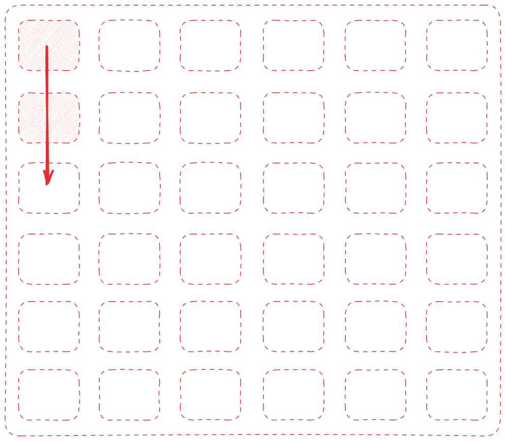

# Task 1 - Cache Memory

| Row Major | Column Major |
|:-:|:-:|
|||

## 📌 Descrição

Este projeto tem como objetivo comparar duas abordagens de multiplicação de matriz por vetor (MxV) em C:
1. **Acesso por linha (Row-Major Order)**: onde a linha externa é a iteração mais externa.
2. **Acesso por coluna (Column-Major Order)**: onde a coluna externa é a iteração mais externa.

Ambas as abordagens são analisadas em termos de desempenho, com tempos de execução medidos para diferentes tamanhos de matrizes. O impacto do uso da memória cache L1 e L2 é investigado para entender como o padrão de acesso influencia a eficiência da execução.

## 🏗️ Metodologia

O código implementa a multiplicação de uma matriz quadrada de tamanho `SIZE x SIZE` por um vetor de tamanho `SIZE`. O tempo de execução de cada abordagem é medido com `gettimeofday()` para garantir alta precisão.

Foram testadas duas formas de alocação:
- **Estática (Stack)**: até onde o limite da pilha permite.
- **Dinâmica (Heap)**: possibilitando testes com matrizes muito maiores.

Os experimentos foram realizados para tamanhos de matriz variando de **100** até **20000**, e os tempos de execução foram registrados.

## 🖥️ Configuração do Sistema

O código foi executado em um **MacBook Air M2 (2022)** com a seguinte configuração de cache:

```bash
$ nproc
> 8

$ sysctl -a | grep cache
> hw.perflevel1.l1icachesize: 131072
> hw.perflevel1.l1dcachesize: 65536
> hw.perflevel1.l2cachesize: 4194304
> hw.perflevel0.l1icachesize: 196608
> hw.perflevel0.l1dcachesize: 131072
> hw.perflevel0.l2cachesize: 16777216
```

### 💾 Estrutura do Cache:

- **Cache L1 (nível 1):**  
  - **Instruções (alto desempenho):** 192 KB  
  - **Dados (alto desempenho):** 128 KB  
  - **Instruções (eficiência):** 128 KB  
  - **Dados (eficiência):** 64 KB  

- **Cache L2 (nível 2, compartilhado):**  
  - **Alto desempenho:** 16 MB  
  - **Eficiência:** 4 MB  

## ⚙️ Compilação e Execução

Para compilar o código, utilize:

```bash
gcc-14 ./task-1.cache-memory/dinamic_matrix_vector_mult.c -o ./task-1.cache-memory/out/dinamic_matrix_vector_mult.o

gcc-14 ./task-1.cache-memory/static_matrix_vector_mult.c -o ./task-1.cache-memory/out/static_matrix_vector_mult.o
```

Para executar:

```bash
./task-1.cache-memory/out/dinamic_matrix_vector_mult.o
./task-1.cache-memory/out/static_matrix_vector_mult.o
```

## 📊 Resultados

### 🔥 Impacto do Acesso à Memória no Desempenho

Os resultados mostraram que o **acesso por linha** (Row-Major) teve um desempenho superior ao **acesso por coluna** (Column-Major), especialmente para matrizes grandes. Isso ocorre devido à melhor **localidade espacial**, aproveitando o cache L1 de forma mais eficiente.

#### 📌 Exemplo de saída:
```bash
💡 Matrix-vector multiplication with SIZE=20000.

> ✅ Memory allocation success!

- 🎯 Execution time (row-major): 1.326828 seconds
- 🎯 Execution time (column-major): 4.125764 seconds

> Results match! ✅
```

### 🏆 Comparação de Tempos

| Tamanho da Matriz | Execução (Row-Major) | Execução (Column-Major) |
|-------------------|---------------------|------------------------|
| 100              | 0.000048s           | 0.000050s              |
| 250              | 0.000146s           | 0.000360s              |
| 500              | 0.001095s           | 0.000722s              |
| 750              | 0.001583s           | 0.001794s              |
| 1000             | 0.003358s           | 0.004163s              |
| 10000            | 0.265163s           | 0.731580s              |
| 20000            | 1.503544s           | 4.290163s              |

🔍 **Conclusões:**
- Para matrizes pequenas (**≤ 500**), a diferença entre Row-Major e Column-Major é pequena.
- A partir de **1000**, a diferença se torna evidente devido ao impacto no cache L1.
- Para matrizes muito grandes (**20000**), Column-Major é significativamente mais lento.

## 📌 Impacto do Cache

- **Row-Major**: Acesso sequencial na memória → Melhor aproveitamento da **localidade espacial** → Menos falhas de cache → Execução mais rápida.
- **Column-Major**: Acesso disperso → Mais **misses de cache** → Tempo de execução maior.
- **Cache L1**: Pequeno, mas muito rápido. Para matrizes grandes, os dados precisam ser buscados no **cache L2** (mais lento) ou até na **RAM**.
- **Alocação Estática vs. Dinâmica**: A alocação **na stack** é limitada e pode causar **segmentation fault** para matrizes grandes, enquanto a alocação **na heap** permite lidar com matrizes maiores.

## 📌 Conclusão

- O **acesso por linha** (Row-Major) é **muito mais eficiente** para grandes matrizes devido ao **uso otimizado do cache**.
- O **acesso por coluna** (Column-Major) sofre mais **misses de cache**, tornando-o consideravelmente mais lento.
- O impacto da alocação na **stack vs. heap** também influencia a execução para matrizes muito grandes.