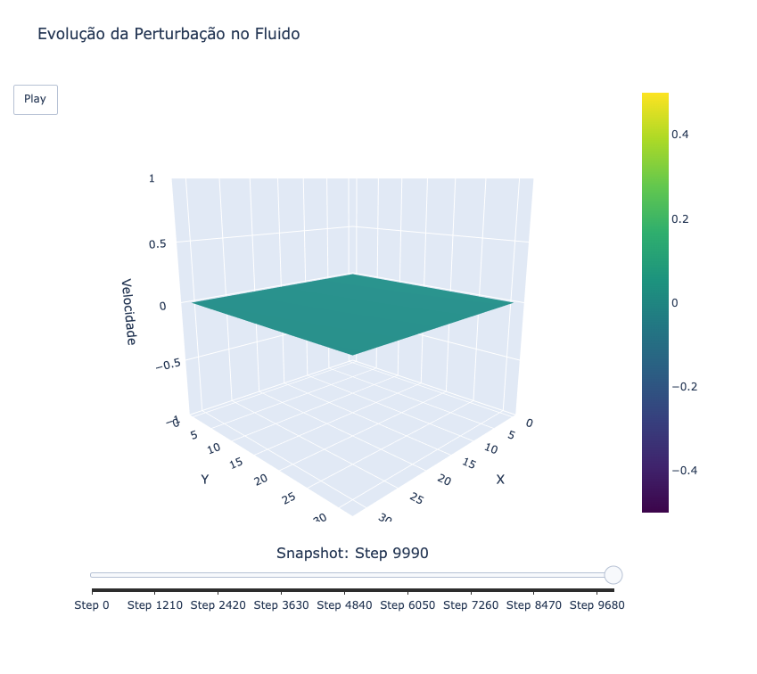
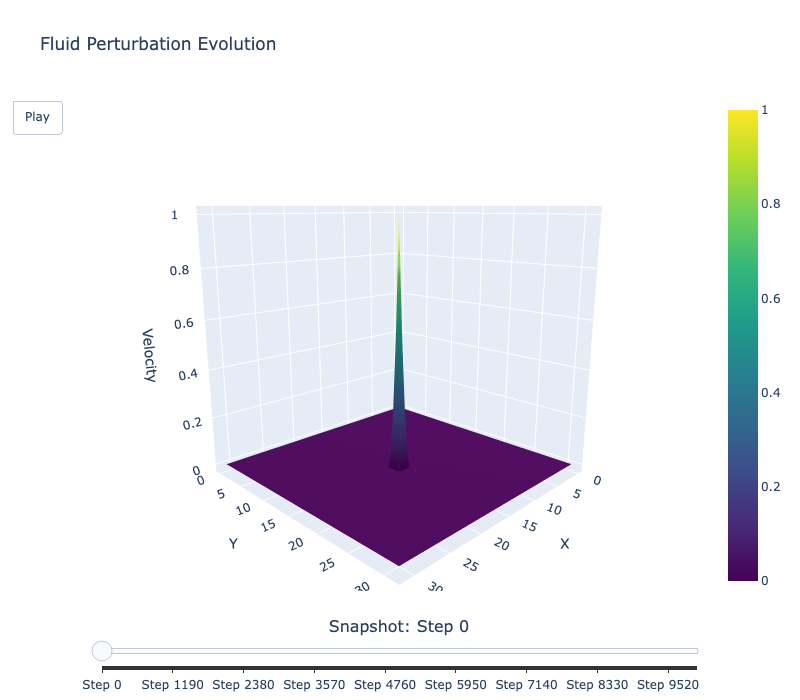
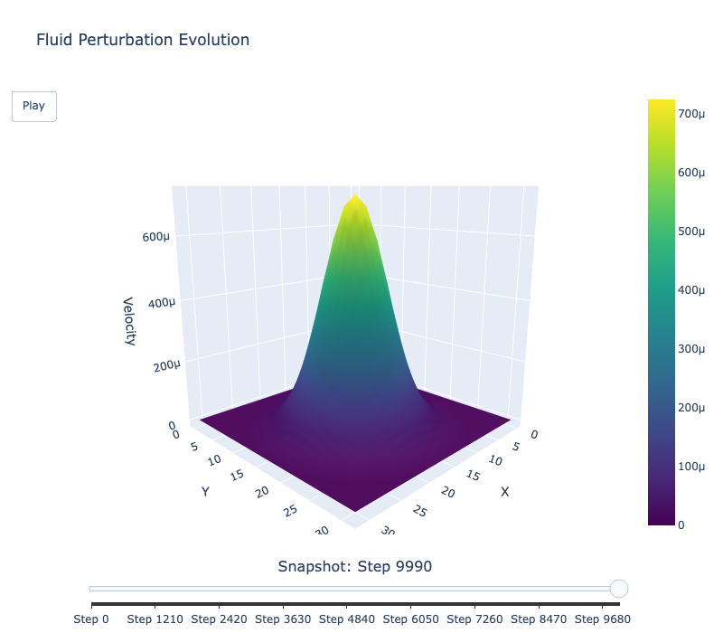
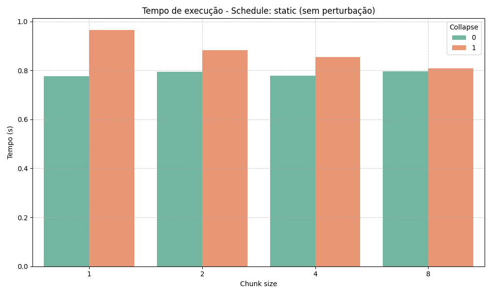
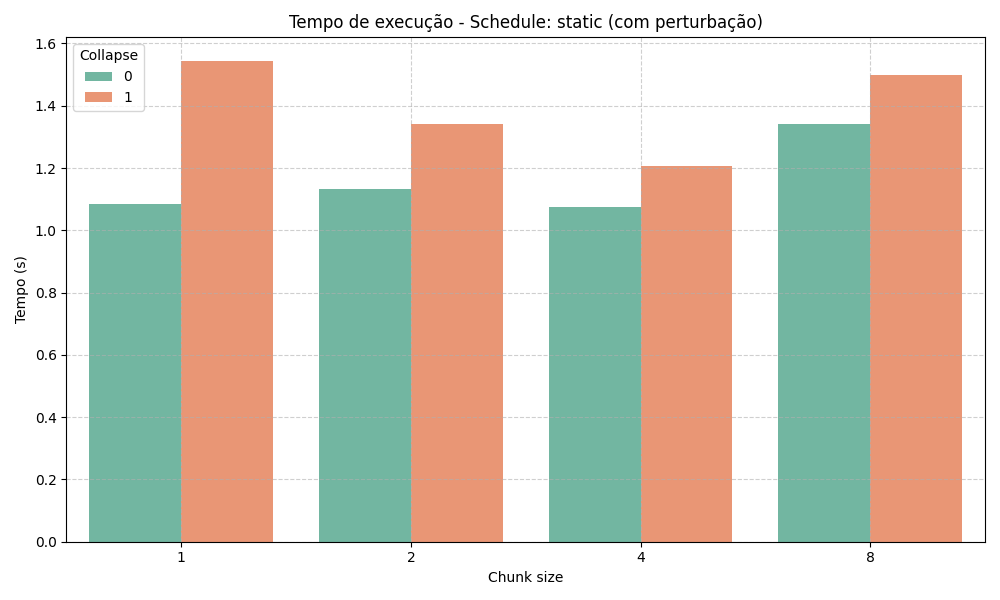
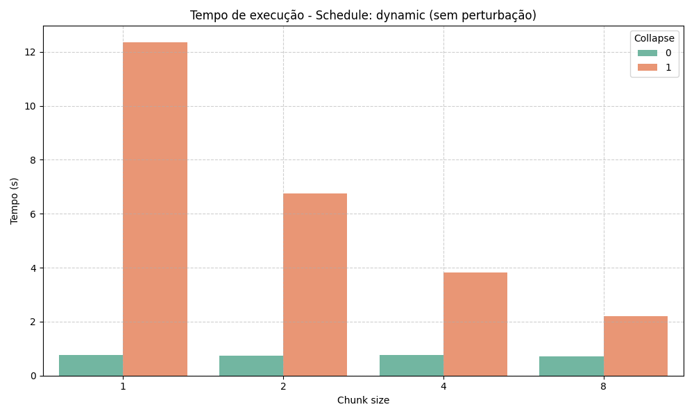
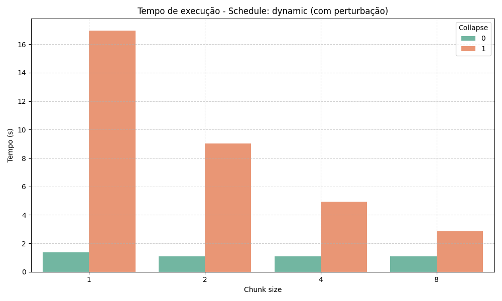
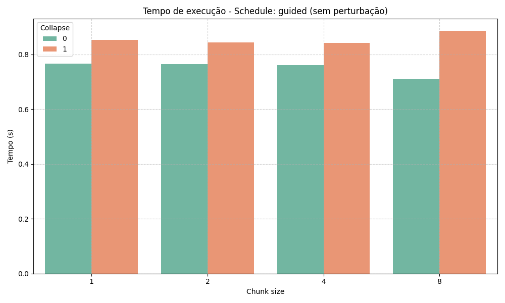
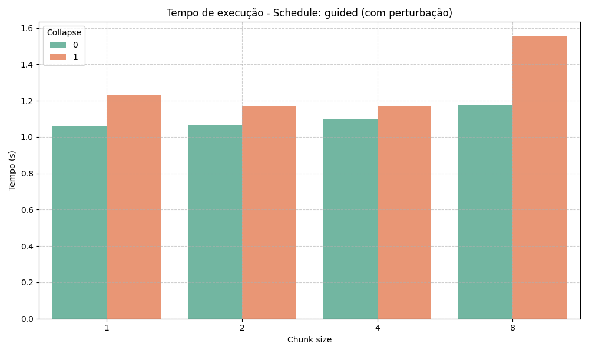

# 🧵 Impacto das Estratégias de Agendamento e da Cláusula `collapse` em Loops Paralelos com OpenMP

| s/ Perturbação                                                          | c/ Perturbação (START) | c/ Perturbação (END) |
|--------------------------------------------------------------------------|------------------------|----------------------|
|  |         |       |

Este projeto investiga como diferentes estratégias de agendamento (`static`, `dynamic`, `guided`) e a utilização da cláusula `collapse` influenciam o desempenho de laços paralelos aninhados com OpenMP. O estudo considera dois cenários: com e sem perturbações externas no sistema (como sobrecarga artificial).

## 🧠 Objetivos

- Avaliar o **desempenho relativo** entre `static`, `dynamic` e `guided` com diferentes tamanhos de chunk.
- Analisar o **impacto da cláusula `collapse(2)`** em loops aninhados.
- Estudar o **comportamento dos agendadores com e sem perturbações externas**, simulando situações reais de carga no sistema.

## ⚙️ Como Compilar e Executar

Compile e execute o programa com o GCC 14 ou superior com suporte ao OpenMP:

```bash
gcc-14 -fopenmp ./task-11.impact-of-schedule-and-collapse-clauses/main.c \
  -o ./task-11.impact-of-schedule-and-collapse-clauses/out/main.o && \
  ./task-11.impact-of-schedule-and-collapse-clauses/out/main.o
```

> Isso irá gerar:
> - Um arquivo binário: `out/output.bin`
> - Um CSV de benchmarking: `data/benchmarks.csv`

## 🧪 Configuração dos Testes

Você pode modificar os parâmetros diretamente no código `main.c`:

| Parâmetro         | Efeito                                                          |
|-------------------|------------------------------------------------------------------|
| `NSTEPS`          | Número de interações para simular maior carga computacional     |
| `WITH_DISTURBANCE`| Ativa/desativa a perturbação simulada com `sleep()`             |
| `collapse(2)`     | Incluído/omitido manualmente no pragma para testar seu efeito   |

## ✅ O que Cada Teste Avalia

| Teste                     | O que avalia                                                                 |
|---------------------------|------------------------------------------------------------------------------|
| Variação de `chunk_size`  | Identifica o melhor tamanho de divisão para cada agendador                  |
| `collapse(2)`             | Verifica se a fusão de loops aninhados melhora o desempenho                 |
| Perturbação               | Testa a robustez das estratégias frente à interferência externa             |
| Comparação entre schedules| Avalia quem entrega melhor tempo em diferentes condições                    |

## 🧠 Principais Conclusões

- 🔹 **`guided + collapse`** foi a melhor opção geral, tanto com quanto sem perturbação.
- 🟩 `static` se comporta bem sem perturbações, mas não lida bem com cenários imprevisíveis.
- 🟨 `dynamic` introduz muito overhead, especialmente quando `collapse` está ativado.
- 🧩 A cláusula `collapse` é benéfica **somente quando usada com agendadores que balanceiam bem a carga** (como `guided`).

## 📊 Visualização dos Resultados

### Benchmarks em 2D (PNGs)

Gere gráficos de desempenho com:

```bash
python ./task-11.impact-of-schedule-and-collapse-clauses/plot_benchmark.py
```

> Os gráficos serão salvos em `./data/`:

| 🔻 Sem Perturbação                                                          | 🔺 Com Perturbação                                                          |
|----------------------------------------------------------------------------|----------------------------------------------------------------------------|
|    |    |
|  |  |
|    |    |

### Visualização 3D Interativa

Para uma análise visual em 3D do desempenho:

```bash
python ./task-11.impact-of-schedule-and-collapse-clauses/plot_bin.py
```

> 💡 Isso abrirá uma **interface web no navegador** com um gráfico 3D interativo (usando *Plotly*). Lembre-se: `pip install pandas matplotlib seaborn plotly numpy`
