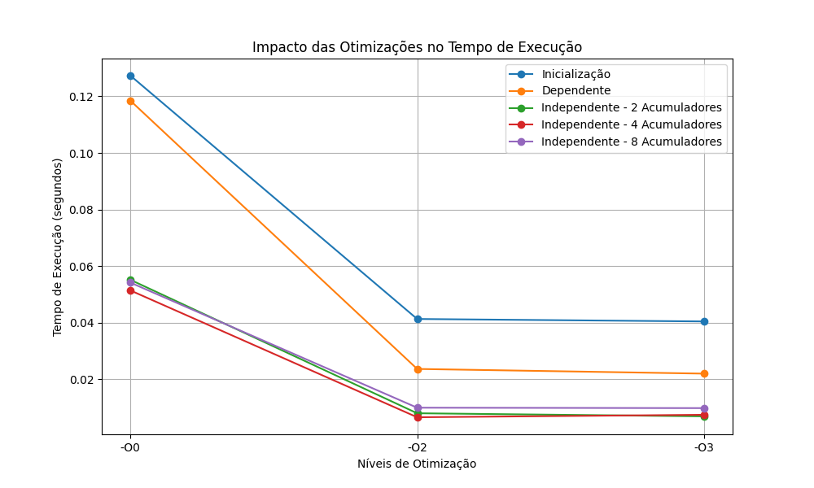

# ILP Benchmark - Investigando o Paralelismo ao Nível de Instrução (ILP)



## Descrição

Este projeto visa investigar os efeitos do paralelismo ao nível de instrução (ILP) em programas sequenciais, avaliando o impacto de diferentes níveis de otimização do compilador. O foco principal é a análise de como a remoção de dependências entre as iterações pode melhorar o desempenho de programas que realizam operações simples e acumulativas sobre grandes vetores.

## Objetivo

O código implementado neste projeto realiza as seguintes operações sobre um vetor de tamanho **N = 100.000.000**:

1. Inicializa um vetor com um cálculo simples.
2. Soma seus elementos de forma dependente (onde cada iteração depende da anterior).
3. Realiza a soma utilizando múltiplos acumuladores para quebrar a dependência e maximizar o paralelismo ao nível de instrução.

O projeto compara os tempos de execução das versões compiladas com diferentes níveis de otimização (-O0, -O2, -O3), analisando o impacto dessas otimizações no desempenho.

## Pré-requisitos

- **gcc** ou **clang** (Compilador C)
- Sistema operacional: macOS ou similar
- Ambiente com **gcc-14** ou versão compatível

## Como Executar

### Passo 1: Compilação e Execução

Primeiro, forneça permissão para o script de execução:

```bash
chmod +x ./task-2.pipeline-and-vectorization/bin/run
```

Em seguida, execute o script e forneça o compilador desejado, por exemplo **gcc-14**:

```bash
👉 Current directory: $(pwd)/task-2.pipeline-and-vectorization/bin

🎯 Enter the compiler to use (e.g., gcc, gcc-14, clang): gcc-14
```

O script compilará o código utilizando diferentes otimizações, como indicado nas próximas etapas.

A compilação ocorrerá automaticamente com os níveis de otimização -O0, -O2 e -O3 e em seguida executará cada uma delas. Abaixo temos um exemplo de saída esperada após a execução para cada nível de otimização.

#### Exemplo de Saída

```bash
- ⏳ Compiling with -O0 using gcc-14...
-- ✅ Compilation with -O0 completed!
-- 📦 Output file: $(pwd)/task-2.pipeline-and-vectorization/bin/../out/main_O0.o
- ⏳ Running main_O0.o...

Initialization time: 0.281583 seconds
Time (dependent): 0.250807 seconds, Result: 1087459712
Time (independent - 2 accumulators): 0.113362 seconds, Result: 1087459712
Time (independent - 4 accumulators): 0.070880 seconds, Result: 1087459712
Time (independent - 8 accumulators): 0.055148 seconds, Result: 1087459712

Consistent results for all versions: Yes
- ✅ main_O0.o executed successfully!

- ⏳ Compiling with -O2 using gcc-14...
-- ✅ Compilation with -O2 completed!
-- 📦 Output file: $(pwd)/task-2.pipeline-and-vectorization/bin/../out/main_O2.o
- ⏳ Running main_O2.o...

Initialization time: 0.043235 seconds
Time (dependent): 0.037755 seconds, Result: 1087459712
Time (independent - 2 accumulators): 0.020071 seconds, Result: 1087459712
Time (independent - 4 accumulators): 0.049652 seconds, Result: 1087459712
Time (independent - 8 accumulators): 0.015424 seconds, Result: 1087459712

Consistent results for all versions: Yes
- ✅ main_O2.o executed successfully!

- ⏳ Compiling with -O3 using gcc-14...
-- ✅ Compilation with -O3 completed!
-- 📦 Output file: $(pwd)/task-2.pipeline-and-vectorization/bin/../out/main_O3.o
- ⏳ Running main_O3.o...

Initialization time: 0.050921 seconds
Time (dependent): 0.021798 seconds, Result: 1087459712
Time (independent - 2 accumulators): 0.015607 seconds, Result: 1087459712
Time (independent - 4 accumulators): 0.015027 seconds, Result: 1087459712
Time (independent - 8 accumulators): 0.007994 seconds, Result: 1087459712

Consistent results for all versions: Yes
- ✅ main_O3.o executed successfully!
```

### Resultados

A tabela abaixo mostra os tempos de execução para diferentes configurações e otimizações:

| Otimização | Tempo de Inicialização (s) | Tempo Dependente (s) | Tempo Independente (2 acum.) (s) | Tempo Independente (4 acum.) (s) | Tempo Independente (8 acum.) (s) |
|------------|----------------------------|-----------------------|-----------------------------------|-----------------------------------|-----------------------------------|
| **-O0**    | 0.127321                   | 0.118464              | 0.055164                          | 0.051404                          | 0.054173                          |
| **-O2**    | 0.041316                   | 0.023662              | 0.007997                          | 0.006590                          | 0.009964                          |
| **-O3**    | 0.040452                   | 0.022007              | 0.006915                          | 0.007453                          | 0.009818                          |

### Conclusões

- As otimizações **-O2** e **-O3** resultaram em uma redução significativa no tempo de execução em comparação com o **-O0**, especialmente nas versões que usam múltiplos acumuladores para eliminar dependências.
- A otimização **-O3** apresentou a melhor performance, mas os ganhos foram marginalmente pequenos em relação ao **-O2** quando as otimizações já estavam suficientemente aplicadas.
- O uso de múltiplos acumuladores (2, 4, 8) reduziu o tempo de execução, mostrando como a remoção de dependências entre as iterações aumenta a eficiência e permite paralelismo.