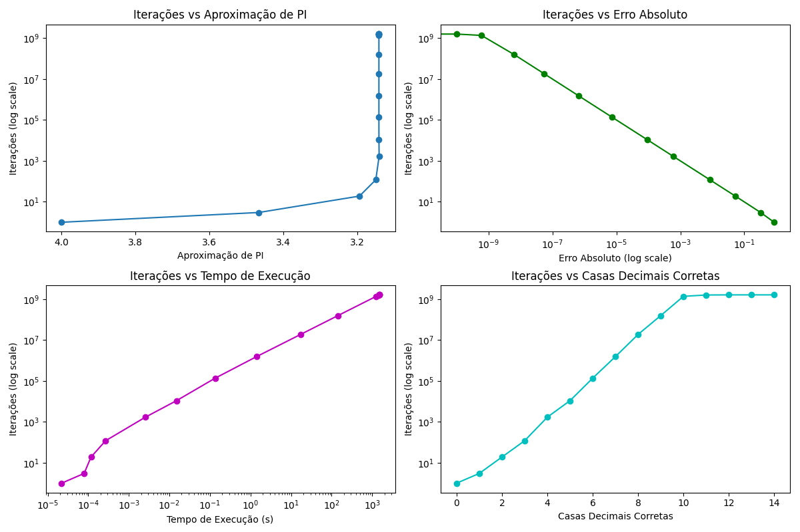

# Aproximação Matemática de π com a Série de Leibniz

Este projeto implementa, em linguagem C, uma aproximação do número π utilizando a série de Leibniz. O programa registra os dados de precisão, iterações e tempo de execução ao longo do processo, que é contínuo (loop infinito). Um script Python auxilia na visualização gráfica dos resultados obtidos.



## 🧠 Fórmula Utilizada

A aproximação é baseada na série de Leibniz:

^k}{2k+1})

## 🧪 Execução do Programa em C

Para compilar e executar o programa, utilize o seguinte comando:

```bash
gcc-14 ./task-3.mathematical-approximation-of-pi/main.c -o ./task-3.mathematical-approximation-of-pi/out/main.o && ./task-3.mathematical-approximation-of-pi/out/main.o
```

> 💡 **Importante**: O programa roda em loop infinito, pois ele continua buscando mais casas decimais corretas de π. Para encerrá-lo, use `CTRL+C`.

## 📁 Local do Resultado

Enquanto o programa executa, os dados são continuamente gravados no seguinte arquivo CSV:

```bash
./task-3.mathematical-approximation-of-pi/data/pi_approximation.csv
```
| Iterations  | Approximation of PI   | Absolute Error | Execution Time (s) | Correct Decimal Places |
|-------------|------------------------|----------------|--------------------|-------------------------|
| 1           | 4.000000000000000      | 0.8584073464   | 0.000022           | 0                       |
| 3           | 3.466666666666667      | 0.3250740131   | 0.000079           | 1                       |
| 19          | 3.194187909231943      | 0.0525952556   | 0.000117           | 2                       |
| 119         | 3.149995866593470      | 0.0084032130   | 0.000267           | 3                       |
| 1,688       | 3.141000236580159      | 0.0005924170   | 0.002559           | 4                       |
| 10,794      | 3.141500009528466      | 0.0000926441   | 0.014958           | 5                       |
| 136,121     | 3.141599999994786      | 0.0000073464   | 0.134407           | 6                       |
| 1,530,012   | 3.141592000000233      | 0.0000006536   | 1.401601           | 7                       |
| 18,660,304  | 3.141592600000001      | 0.0000000536   | 17.149694          | 8                       |
| 155,973,051 | 3.141592659999999      | 0.0000000064   | 143.128878         | 9                       |
| 1,362,988,896 | 3.141592653000000    | 0.0000000006   | 1255.245897        | 10                      |
| 1,584,294,516 | 3.141592653500000    | 0.0000000001   | 1459.173499        | 11                      |
| 1,608,612,706 | 3.141592653580000    | 0.0000000000   | 1481.370748        | 12                      |
| 1,611,227,808 | 3.141592653589000    | 0.0000000000   | 1483.765222        | 13                      |
| 1,611,428,360 | 3.141592653589700    | 0.0000000000   | 1483.949505        | 14                      |

## 📊 Visualização Gráfica com Python

Para gerar os gráficos com os dados obtidos, execute o script Python:

```bash
python /Users/ernane/me/programacao_paralela/task-3.mathematical-approximation-of-pi/helpers/plot.py
```

### ✅ Dependências Python

O script depende apenas das seguintes bibliotecas:

```python
import pandas as pd
import matplotlib.pyplot as plt
import os
```

### 💡 Ambiente Virtual (opcional)

Para evitar conflitos com outras bibliotecas no sistema, recomenda-se criar um ambiente virtual:

```bash
python -m venv venv
source venv/bin/activate  # Linux/macOS
venv\Scripts\activate     # Windows

pip install pandas matplotlib
```