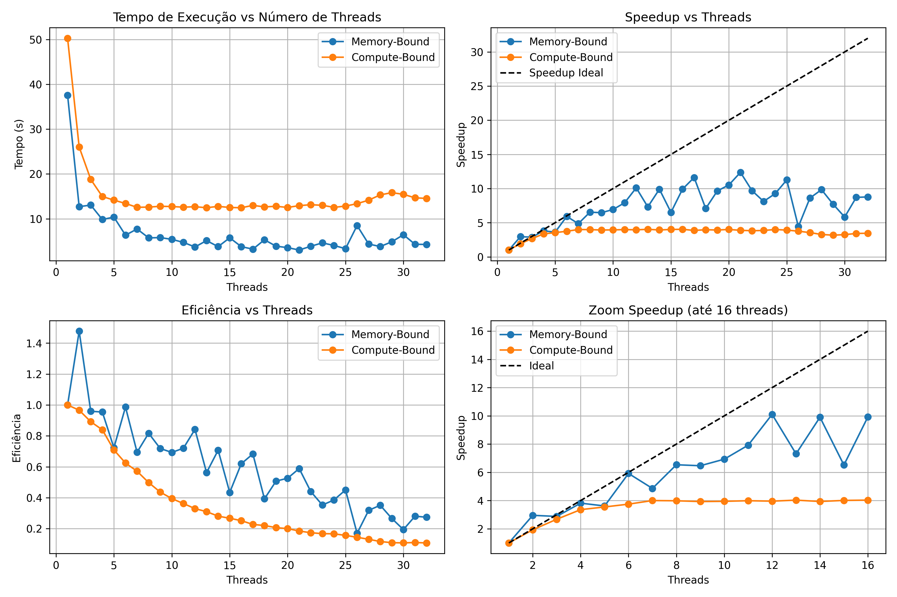

# 🔁 Memory vs CPU Bound – OpenMP Benchmark


([Resultados - Ultima execução](./data/results.csv)).

Este projeto compara o desempenho de dois tipos de aplicações paralelas utilizando OpenMP em C: uma **memory-bound** (limitada por acesso à memória) e outra **compute-bound** (limitada por capacidade de processamento).

A motivação é entender como diferentes tipos de cargas reagem à paralelização, especialmente em sistemas com suporte a multithreading por hardware, como o Apple Silicon (M2).  

O projeto automatiza a execução, coleta os dados em log, gera um CSV estruturado e cria gráficos com análise de desempenho.

## 🛠️ Compilando os programas

Antes de executar, compile os dois programas com o `gcc-14` (ou outro compilador com suporte a OpenMP):

```bash
gcc-14 ./task-4.memory-or-cpu--bound-applications/compute_bound.c -o ./task-4.memory-or-cpu--bound-applications/bin/compute_bound -fopenmp -lm
gcc-14 ./task-4.memory-or-cpu--bound-applications/memory_bound.c -o ./task-4.memory-or-cpu--bound-applications/bin/memory_bound -fopenmp
```

## ▶️ Execução individual

Você pode executar os programas manualmente passando o número de threads como argumento:

```bash
./task-4.memory-or-cpu--bound-applications/bin/compute_bound 8
./task-4.memory-or-cpu--bound-applications/bin/memory_bound 8
```

## ⚙️ Execução automatizada

Um script Bash (`run`) foi criado para testar os dois programas variando o número de threads (até 32 por padrão).

### 1. Dê permissão de execução

```bash
chmod +x ./task-4.memory-or-cpu--bound-applications/bin/run
```

### 2. Execute

```bash
./task-4.memory-or-cpu--bound-applications/bin/run
```

O resultado será salvo em:

```bash
./task-4.memory-or-cpu--bound-applications/data/execution.log
```

## 📄 Gerando CSV com os dados

O script `csv` extrai os tempos do log e gera um CSV pronto para análise.

### 1. Permissão

```bash
chmod +x ./task-4.memory-or-cpu--bound-applications/bin/csv
```

### 2. Execução

```bash
./task-4.memory-or-cpu--bound-applications/bin/csv
```

O CSV será salvo em:

```bash
./task-4.memory-or-cpu--bound-applications/data/results.csv
```

## 📊 Visualização gráfica

O script Python `plots.py` gera visualizações com base no CSV.

### 1. Execute

```bash
python ./task-4.memory-or-cpu--bound-applications/data/plots.py
```

Isso irá gerar uma imagem com 4 gráficos: tempo de execução, speedup, eficiência e zoom de speedup até 16 threads.

### 2. Dependências

Opcionalmente, use um ambiente virtual:

```bash
python -m venv .venv
source .venv/bin/activate
pip install pandas matplotlib
```

Instale via `pip`:

```bash
pip install pandas matplotlib
```

## 📍 Ambiente de Testes

Os testes foram realizados em:

- 💻 Apple MacBook Air M2 (2022)
- 🧠 8 núcleos físicos com suporte a multithreading
- 🍎 macOS Sequoia 15.3.2
